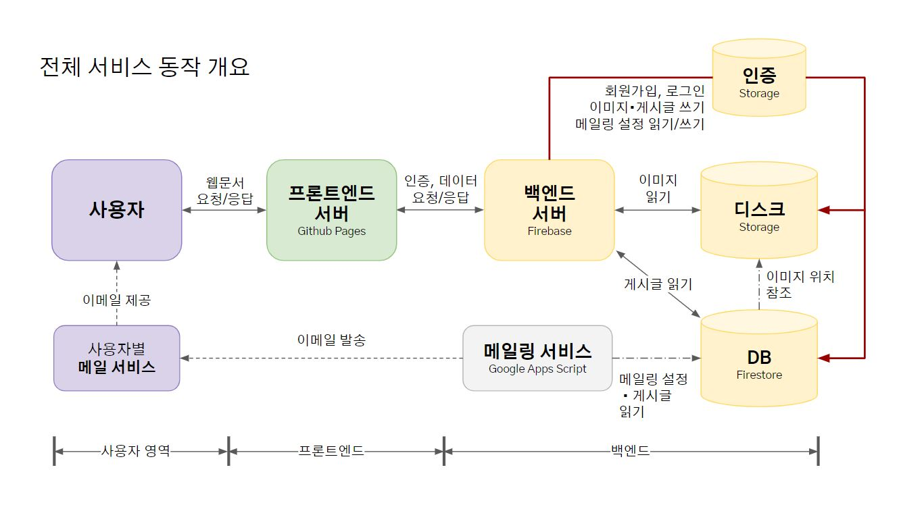

# 일상두리

> 오늘의 환경문제에 맞서 우리의 할 일을 찾는 곳 :: KBSC2022 예선 탈락

마감 5일전 공모전을 발견해 3일에 걸쳐 개발한 간단한 웹사이트입니다.
주제는 ESG였습니다. Vue.js 걸음마 수준에서 만들었습니다. → [짧은 회고](#아무말-대잔치)

### 링크

- 📢 [KBSC 2022](https://www.kbsccoding.com/board/board.php?bo_table=notice&wr_id=69)
- 💡 개발 계획서 [구글 프리젠테이션](https://docs.google.com/presentation/d/1pShgClLy7AHpHPruYaAMaTbGgQ6BBt8v5paFADXBaeU/edit?usp=sharing) | [PDF파일]()

### 기능

`일상두리`는 사용자가 자발적으로 일상 속의 환경을 위한 구체적 실천 방안을 공유하고 축적된 정보들을 이메일로 받아볼 수 있는 웹 기반 서비스입니다. 아래 세 가지 행동 요소를 정의한 뒤 웹 프로그램으로 구현했습니다.

- 공유 : 사용자는 환경문제 대응을 위한 구체적 실천 방법을 자발적으로 공유한다.
- 제안 : 시스템은 플랫폼 유지와 메일링 서비스의 제공을 통해 사용자에게 지속적으로 행동을 제안한다.
- 참여 : 사용자는 공유된 방법을 실천함으로써 환경 보호에 참여한다.


### 구현에 사용된 것들



- 프론트엔드
  - HTML, CSS, JS
  - [Vue.js 2](https://github.com/vuejs/vue)
  - [Vue-router](https://github.com/vuejs/vue-router)
  - [reset.css](http://meyerweb.com/eric/tools/css/reset/)
- 백엔드 : [Firebase](https://firebase.google.com/)
- 메일
  - [Google Apps Script](https://script.google.com)
  - [FirestoreGoogleAppsScript](https://github.com/grahamearley/FirestoreGoogleAppsScript)
- 이미지
  - <a href="https://www.flaticon.com/free-icons/team" title="team icons">Team icons created by Freepik - Flaticon</a>
  - <a href="https://www.flaticon.com/free-icons/person" title="person icons">Person icons created by CreativeCons - Flaticon</a>
  - <a href="https://www.flaticon.com/free-icons/computer" title="computer icons">Computer icons created by BizzBox - Flaticon</a>
  - <a href="https://www.flaticon.com/free-icons/back" title="back icons">Back icons created by Freepik - Flaticon</a>
  - <a href="https://www.flaticon.com/free-icons/add" title="add icons">Add icons created by Pixel perfect - Flaticon</a>
  - <a href="https://www.flaticon.com/free-icons/close" title="close icons">Close icons created by xnimrodx - Flaticon</a>
  - <a href="https://www.flaticon.com/free-icons/empty" title="empty icons">Empty icons created by Icon.doit - Flaticon</a>
  - <a href="https://www.freepik.com/free-photo/wooden-board-with-unfocused-nature-background_996396.htm#query=eco%20background&position=47&from_view=search">Image by tirachard on Freepik</a>

# 프로그램 구조

### 폴더 구조

이 README가 있는 레포지토리의 가장 최상단에는 index.html이 있습니다.

- `index.html` : Vue 루트 컴포넌트의 템플릿이자 모든 JS, CSS파일을 읽어들이는 파일입니다. Vue.js 코드도 여기서 읽어옵니다. 이 템플릿에 대한 스크립트는 src/main.js입니다.

`src`의 가장 위에는 아래 파일들이 있습니다.

- `main.js` : Vue 루트 컴포넌트(=`index.html`)에 대한 스크립트입니다. 대부분의 설정은 여기서 합니다.
- `routeStyles.css` : 하위 폴더 `routes`안의 모든 css를 import하는 파일입니다.
- `componentsStyles.css` : 하위 폴더 `components`안의 모든 css를 import하는 파일입니다.

```
[repository]
  ├─ index.html
  │
  ├─ LICENSE
  ├─ README.md
  ├─ 개발 계획서 pdf파일 (구글 프리젠테이션과 동일한 내용)
  │
  └─[src]
      ├─ main.js
      │
      ├─ reset.css
      ├─ global.css
      │
      ├─ routeStyles.css
      ├─ components.css
      │
      └─ (...하위 폴더들...)
```

`src`하위에는 4개 폴더가 있습니다.

- `routes` : 페이지 단위의 컴포넌트를 담고 있습니다.
- `components` : 페이지에서 불러와 사용하는 컴포넌트를 모두 담고 있습니다.
- `utilities` : 컴포넌트에서 사용하는 스크립트의 모음입니다.
- `images` : 프로그램에서 사용하는 모든 이미지들을 담고있습니다.

```
[src]
  ├─ (...파일들...)
  │
  ├─ [routes]
  ├─ [components]
  ├─ [utilities]
  │   ├─ serviceEnum.js     : Enum을 나름대로 정의한 스크립트입니다.
  │   └─ firebaseToolket.js : 파이어베이스를 사용하는 스크립트를 행위 단위로(로그인하기, 글쓰기, 글 지우기 등) 그룹화한 스크립트입니다.
  └─ [images]
      └─ (...이미지들...)
```

### 컴포넌트 계층 구조

루트 컴포넌트 바로 아래에는 총 6개 컴포넌트가 있습니다.
화면의 골격을 이루는 컴포넌트는 header, router-view, footer입니다.

그 밖의 writer, viewer, overlay는 router-view아래에서 특정 이벤트가 올라오면 화면에 표시됩니다.

```
ROOT
  ├─ AppHeader
  ├─ RouterView
  ├─ AppFooter
  │
  ├─ ArticleWriter
  ├─ ArticleViewer
  │
  └─ LoadingOverlay
```

router-view에서 표시하는 페이지는 총 6가지 입니다. (Main, Habit, Challenge, Learn, Auth, Mypage)
각 페이지가 포함하는 컴포넌트를 표시하면 다음과 같습니다.

```
Main
└─ HorizontalList

Habit, Challenge, Learn
└─ SquareItem

Auth

Mypage
├─ EmailSettingWriter
├─ RowItem
├─ ArticleRewriter
└─ DeleteConfirmModal

```

# 회고 : 아무말 대잔치

3일간의 짧은 여정이었지만 날것의 Vue.js를 처음 만나는 기회였기에 그 의미가 깊습니다.

### 당시 상황

Vue.js를 막 배우기 시작한 단계였는데 공모전 마감 전날까지도 SFC가 무엇인지도 모르는 상태였습니다.
서버의 역할로 파이어베이스를 세워두었는데 이것도 아예 모르는 상태였습니다. 필요한 것만 얌체처럼 골라 배워 써먹었습니다.
Vue.js와 파이어베이스를 사용하는 '느낌'을 얕은 깊이에서 무척 빠르게 배울 수 있었던 3일을 보냈습니다.

### 공개의 이유

KBSC를 잠깐이나마 준비하면서 1~4회 대회의 탈락/수상작을 보고 싶었는데 정보가 없는 수준에 가까웠습니다. 본래는 어딘가에 공개할 생각이 없었는데, 다음 해의 대회를 준비하시는 분들께 제 탈락작이라도 보여드리고 싶은 마음에 부끄럽지만 공유드립니다.

2022 본선 진출작이 10월 31일 공개되었는데 해를 거듭할 수록 전체적인 출품작 수준이 눈에 띄게 높아지고 있는 것으로 봤습니다. 이제 이 정도 프로그램으로는 어림도 없습니다.

### 프로그램의 문제점

- 왜 탈락했나 : 예선 탈락 사유는 명확합니다. 프로그램의 볼륨이 작고 기능이 단조로웠으며 당시에는 해결할 수 없었던 잔버그가 있었습니다. 인지하고 있는 버그는 오늘 해결했습니다. 이제와서 다시 보니 너무 쉬운 문제였습니다.
- 프로그램 작성 자체의 문제점은?
  - 프레임워크에 대한 이해도 부족
  - 원시적인 구성 : html, css, js 그리고 vue밖에 없습니다. 나름 정리해보겠다고 `componentStyles.css`처럼 여러 파일을 차곡차곡 정리해서 `index.html`에서 불러오는 눈물겨운 일을 했습니다.
  - 혼란스러운 식별자 네이밍 : Vue가 식별자를 어떻게 인식하는지 잘 몰랐습니다. Vue특성상 케밥케이스와 카멜케이스가 프로그램에 혼재해있는데, 템플릿에서 케밥케이스로 내려준 props를 js에서 찾을 수 없다고 생각했습니다. 그 당시 나름 해결하고자 한 흔적으로 한 컴포넌트에 비슷한 이름의 변수가 난립한 것을 들 수 있습니다. (props의 'articles', data의 'myArticles','allArticles') 어느 순간 부터는 두 단어 이상이 오는 그 자체가 스트레스가 되어서 한 단어로 이름을 짓기 시작했고, 그 결과 의미가 명확하지 않은 이름이 탄생했습니다. (`email`, `type`)
  - 재사용성 없는 컴포넌트 : 컴포넌트의 원자화가 잘 안되었고, 각 컴포넌트는 재사용성이 현저히 떨어졌습니다. 그 당시 기능을 구현하기에 급급했는지 글쓰기 Form을 사용 케이스에 따라 3개 컴포넌트로 각각 구현했습니다(ArticleWriter, ArticleViewer, ArticleRewriter). 대부분의 컴포넌트 구성을 살펴보면 요소 간 결합이 너무 강해서 떨어뜨리는 것보다 새로 개발하는게 더 빠를 정도입니다.
  - props의 타입 체킹 부재
  - 중복된 props의 전달 : `index.html`에서 `articles`하나만 내리면 될 것을 그 프로퍼티들도 각각 넘겨준 사례가 있습니다.
  - 모바일 브라우저에 대한 고려 없음
  - 그리고 또.. 이제서야 보이는 그 밖의 많은 것들
